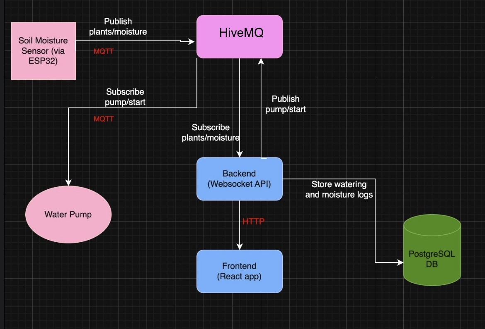

# Smart Plant Watering System

## 1. Project Title  
Smart Plant Watering System

## 2. Project Description  
This project is an IoT-based smart plant watering system. It uses an ESP32 microcontroller to measure soil moisture and control a water pump. The ESP32 communicates with a C# backend over an MQTT broker (HiveMQ). The backend uses both REST APIs and WebSockets to communicate with the React frontend and stores plant data, including moisture levels, moisture thresholds, plant name, type, and watering logs in a PostgreSQL database. 

The React frontend allows users to monitor their plant’s status in real-time and trigger manual watering.

The backend follows the Onion Architecture pattern.

## 3. Technologies Used  
- ESP32 with Arduino  
- MQTT (HiveMQ)  
- C# Backend with WebSockets, REST API, and PostgreSQL  
- React + TypeScript Frontend  
- WebSockets for real-time communication  
- REST for Plants' CRUD operations  

## 4. Architecture  
The system follows a fullstack IoT model:  
ESP32 → MQTT Broker → C# Backend → WebSocket/Rest API → React Frontend  

## 5. Data Flow  
- The ESP32 reads soil moisture periodically (every hour).  
- It publishes moisture readings to the MQTT broker.  
- If moisture is low or a manual command is received, it activates the pump.  
- After watering, updated moisture data is sent to the backend.  
- The backend receives data over MQTT and stores it in the database.  
- Real-time updates are sent to the frontend via WebSockets.  
- The frontend uses REST to load plant details and WebSockets for live updates and manual watering control.  

## How to Use  
Access the deployed application here:  
[Link](https://plants-123-a132a.web.app/)

Login credentials:  
- Email: `a@b.c`  
- Password: `Admin123-`  

## By Nilofar Yosufzai
